# Activity lifecycle & layouts

# Topics
- Activity lifecycle
- UI Layouts
- How to pass arguments between activities
- How to store data at configuration change.

## Basic Requirements

Complete exercises below

## Exercise 1. UI Layout

- Create an app that implement this layout:

  | Opening app | Clicking into the button with empty text | Clicking into the button with valid text | Clicking into the button with empty text |
  |-|-|-|-|
  | 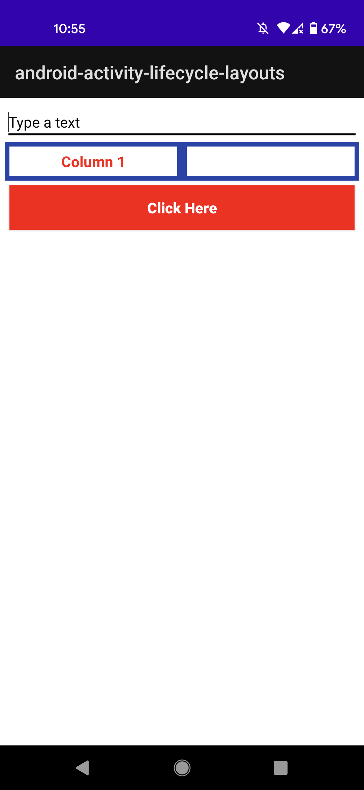 | 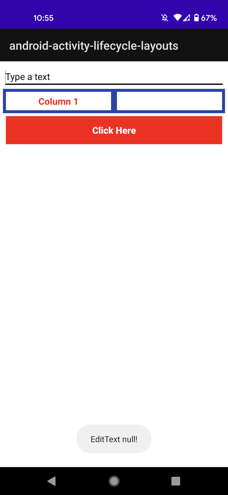 | 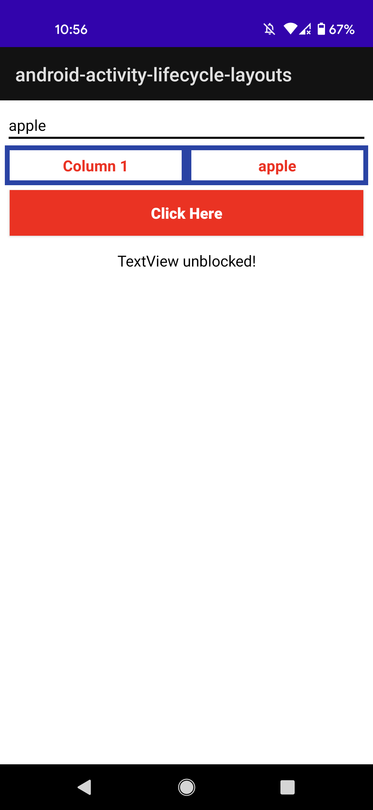 | 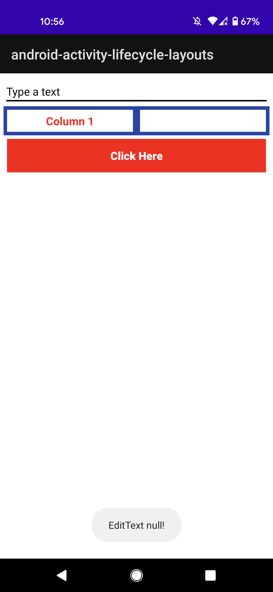 | 

- This layout should use a `TableLayout` and a `LinearLayout`
- This app must have the following behaviors:
  - When we click into the `Button`:
    - If the text content of the `EditText` isn't empty:
      - Place this content into the blank `TextView`
      - Show a `TextView` with content `"TextView unblocked!"`
    - If the text content of the `EditText` is empty:
      - Erase the content of the "blank" `TextView`
      - Show a `Toast` message saying "EditText null!"
      - Hide the `TextView` with content `"TextView unblocked!"`
- It is mandatory to use [ViewBinding](https://developer.android.com/topic/libraries/view-binding) to access the XML view inside the Kotlin classes

### Solution

- Check the source code

## Exercise 2. Passing arguments between Activities

- Create an app that implement this layout:

  | Opening app | Clicking into "GO TO SCREEN 2" | Clicking into "GO TO SCREEN 3" |
  |-|-|-|
  | 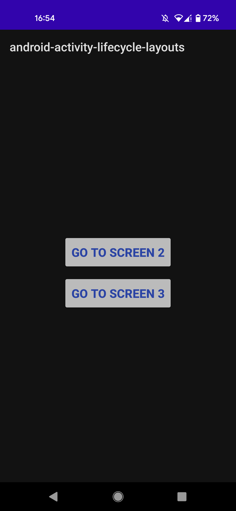 | 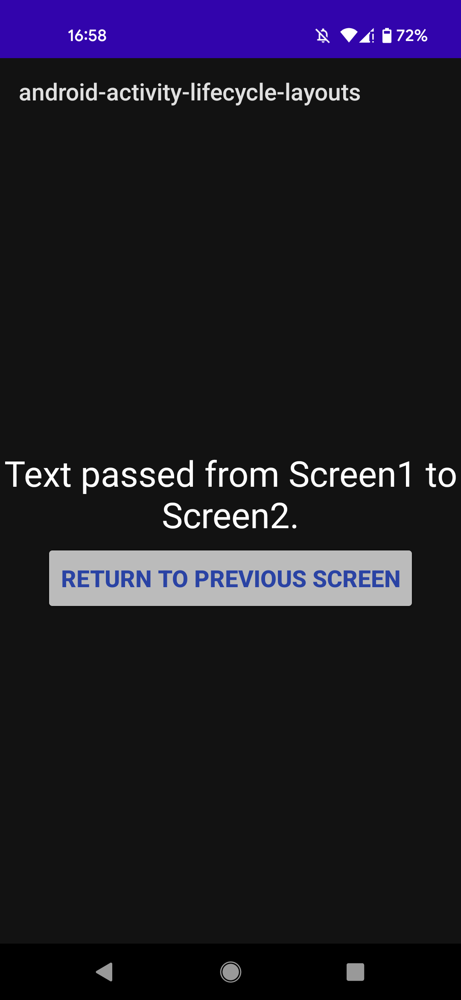 | 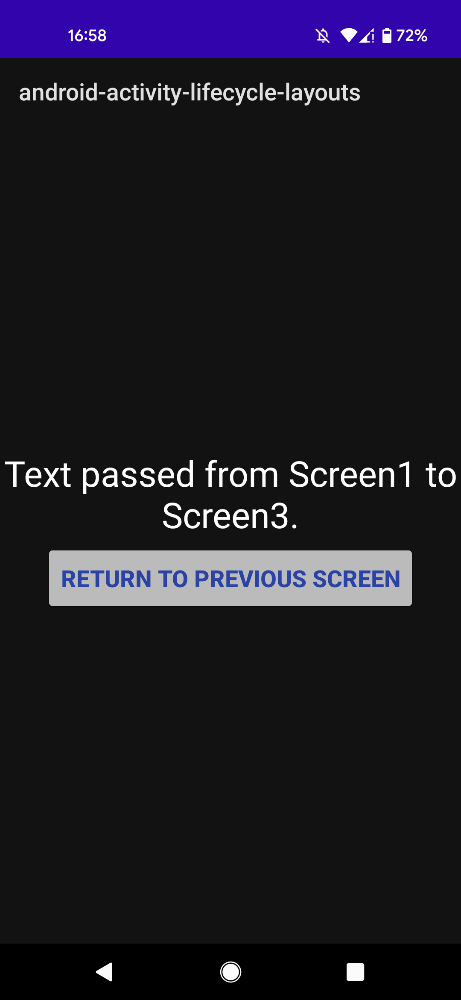 |

- This layout should use 3 simple `LinearLayout`'s in each of the 3 screens
- This app must have the following behaviors:
  - When the app is in Screen 1 and:
    - We click into `GO TO SCREEN 2`, the app goes from Screen 1 to Screen 2
      - Also, the app sends a `String` message from Screen 1 to Screen 2
      - When the app goes to Screen 2, this message should be showed in a `TextView` above the button `RETURN TO PREVIOUS SCREEN`
    - We click into `GO TO SCREEN 3`, the app goes from Screen 1 to Screen 3
      - Also, the app sends a `String` message from Screen 1 to Screen 3
      - When the app goes to Screen 3, this message should be showed in a `TextView` above the button `RETURN TO PREVIOUS SCREEN`
  - When the app is in Screen 2 and:
    - We click into `RETURN TO PREVIOUS SCREEN`, the app goes back to the previous screen
      - When the app goes back to Screen 1, it must be showed a `Toast` message "Activity called was SecondActivity"
  - When the app is in Screen 3 and:
    - We click into `RETURN TO PREVIOUS SCREEN`, the app goes back to the previous screen
      - When the app goes back to Screen 1, it must be showed a `Toast` message "Activity called was ThirdActivity"

### Solution

- Check the source code

## Exercise 3. Storing data at configuration change

- Create an app that implement this layout:

  | Opening app | Clicking into the button with empty text | Clicking into the button with valid text |
  |-|-|-|
  | 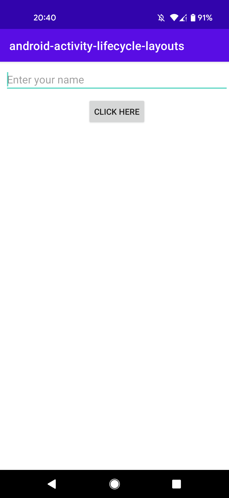 | 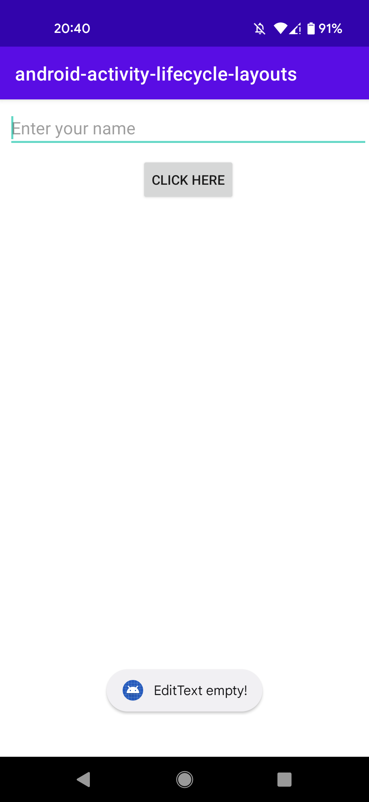 | 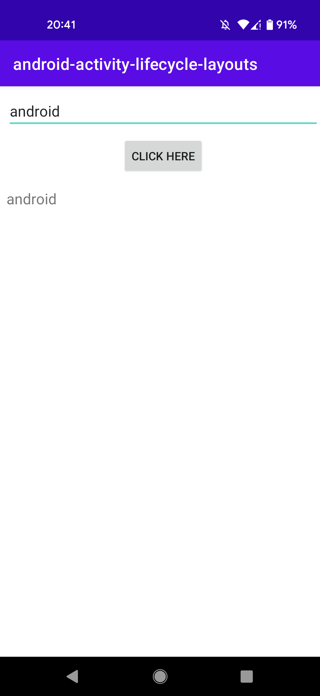 |

  | Rotating screen |
  |-|
  | 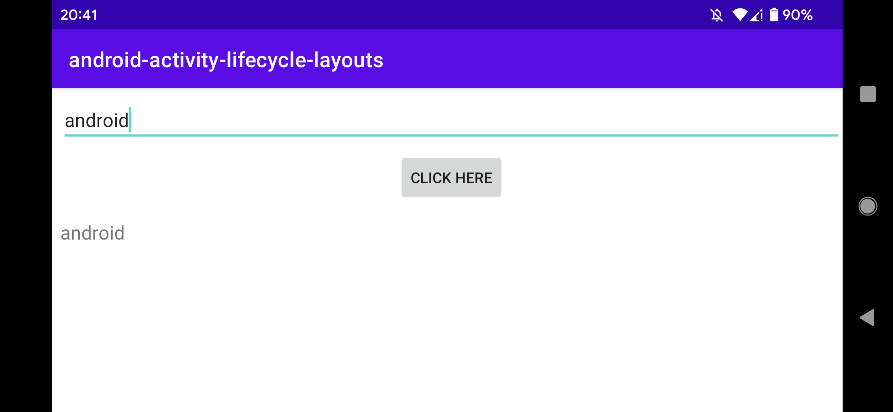 | 

- This layout should use a `ConstraintLayout`
- This app must have the following behaviors, very similar to the ones in Exercise 1:
  - When we click into the `Button`:
    - If the text content of the `EditText` isn't empty:
      - Show the `TextView`, and place its text equal to the content typed into the `EditText`
    - If the text content of the `EditText` is empty:
      - Show a `Toast` message saying "EditText empty!"
      - Hide the `TextView`
- It is mandatory to use [ViewBinding](https://developer.android.com/topic/libraries/view-binding) to access the XML view inside the Kotlin classes
- When we change orientation of the device (emulator/physical device), the content of the `TextView` must be preserved

### Solution

- Check the source code

## Resources

- [Activity lifecycle](https://developer.android.com/guide/components/activities/activity-lifecycle)
- [UI Layouts](https://www.tutlane.com/tutorial/android/android-ui-layouts-linear-relative-frame-table-listview-gridview-webview)
- [How to pass arguments between activities](https://devofandroid.blogspot.com/2018/03/pass-data-between-activities-using.html)
- [How to store data at configuration change](https://developer.android.com/guide/components/activities/activity-lifecycle#saras)
