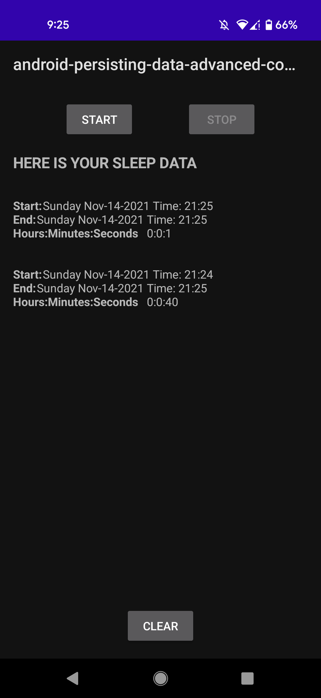
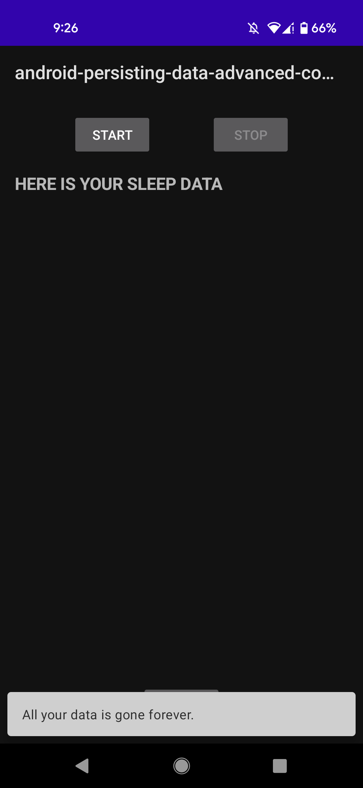

# Persisting data, advanced concept

# Topics
- Shared preferences
- Room
- Offline mode, when to do it, how to do it

## Basic Requirements

Complete exercises below

## Exercise 1. Shared Preferences

- Given the app into [this repository](https://github.com/CodeOp-tech/bumble-android-assignments/tree/master/android-persisting-data-advanced-concept/android-persisting-data-advanced-concept_ex1):
	- Implement a class `DataSource` that stores all `Datetime` values into a in memory database
	- You will need to use the concept of `SharedPreferences` to achieve this goal
	- Change the signature of class `Datetime` to the one below:

		```
		data class Datetime(val id: String, val millis: Long)
		```

	- Also, each time the `Button` is clicked, create a random string `Id`:

		```
		fun generateRandomId(): String {
		    val allowedChars = ('A'..'Z') + ('a'..'z') + ('0'..'9')
		    return (1..STRING_LENGTH)
		        .map { allowedChars.random() }
		        .joinToString("")
		}
		```

## Exercise 2. Database with Room

- Create an app in MVVM Architecture, that:
	- Implement a database using `Room`, `Coroutines`, `ViewModel`, `LiveData` and `DataBinding`
- This app must implement a database to manipulate the following class:

	```
	data class Snapshot(
    	val startTimeMilli: Long = System.currentTimeMillis(),
    	var endTimeMilli: Long = startTimeMilli,
	)
	```

- The class `SnapshotDao` must contain the following methods:

	```
	suspend fun insert(snapshot: Snapshot)
    suspend fun update(snapshot: Snapshot)
    suspend fun get(key: Long): Snapshot?
    suspend fun clear()
    suspend fun getSnapshot(): Snapshot?
    fun getAllSnapshots(): LiveData<List<Snapshot>>
	```

- This app must contain the following layout:

	| Opening app | Clicking into Start button | Clicking into Stop button |
	|-|-|-|
	|  |  |  |

	| Clicking into Start and then Stop | Clicking into Clear button |
	|-|-|
	|  |  | 

- Basically, we have:
	- Three `Button`'s
	- When `Start` is enabled, `Stop` and `Clear` must be disabled
	- After `Start` is clicked, `Start` must be disabled, `Stop` and `Clear` must be enabled
	- After `Stop` is clicked, `Stop` must be disabled, `Start` and `Clear` must be enabled
	- After `Clear` is clicked, `Clear` must be disabled, `Start` must be enabled, and `Clear` must be disabled
		- Also, a `Snackbar` with message "All your data is gone forever." must be showed 
	- All those validations must be done in a `ViewModel` class
	- A `TextView` to show all `Snapshot`'s clicked
		- Each time the sequence `Start` > `Stop` happens, a new `Snapshot` must be appended to this `TextView`
- When the app is restarted, the data must be retrieved from the database

## Exercise 3. Repository Pattern

- Read [this link](https://developer.android.com/jetpack/guide) about the **Repository Architecture**
- Create a summary about what you read
- **PS.:** The teacher will pick some student to explain about this concept to the whole class

## Resources

- [Shared preferences](https://developer.android.com/training/data-storage/shared-preferences)
- [Room](https://developer.android.com/training/data-storage/room)
- [Offline mode, when to do it, how to do it](https://developer.android.com/jetpack/guide)
